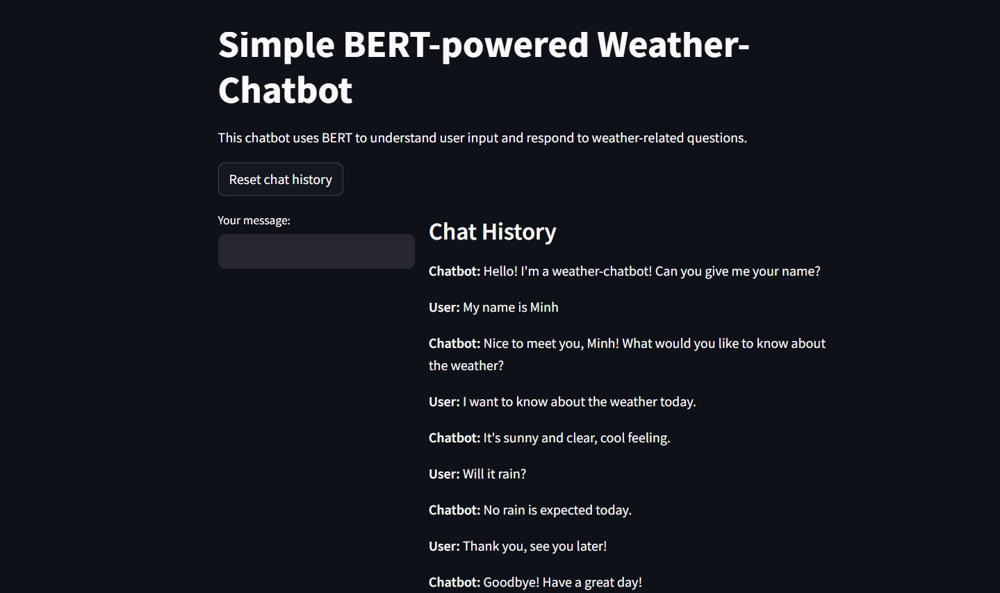

# A Simple Weather-Chatbot using Python
### In this project, I implemented a simple chatbot with the main topic of conversation being to ask about today's weather, using Python language.
## I. Introduction
### This chatbot is set up to perform the following functions
- Greet the user and ask their name
- Respond to basic questions about the weather (predefined responses).
- Recognize when the user wants to end the conversation.
### Files list
|STT|       File name       |                             Function                                         |
|:--|:----------------------|:-----------------------------------------------------------------------------|
| 1 |predefined_input.txt   |Contains sample input sentences on the topics: weather questions and goodbye greetings|
| 2 |predefined_response.txt|Contains corresponding responses to weather questions in the file predefined_input.txt|
| 3 |model.py               |Contains relevant necessary functions, using BERT base model|
| 4 |app_web.py             |Using streamlit library to create a simple interactive interface for chatbot|
### Approach
- First, the chatbot will default to greeting the user and asking for the user's name
- After the user responds to the name request, I perform Name Entity Recognition to recognize the user's name.
- Next, I use a predefined question to ask if the user has any questions about the weather.
- If the user has a question about the weather, I will compare it to the predefined weather question templates and return the appropriate response.
- All user inputs (except the name response) are checked to see if it implies a desire to leave the conversation. If so, the chatbot bids the user farewell with the predefined response template.
## II. Model and Libraries
### 1. Model 
In this project, I use BERT model to extract vector embedding for required text sentences and NER task. I use the pre-trained [https://arxiv.org/abs/1810.04805](BERT) base version from Hugging Face's transformers library. 

**Why I chose to use pre-trained BERT base?:**
- This is a model built on the Transformer architecture, an extremely popular architecture and the core of today's large language models. BERT considers the context for a token based on the tokens before and after, helping to fully capture the content of the text.
- I did not use more complex or powerful models because they are resource intensive to run and can take a long time on devices with less powerful hardware. Moreover, given the requirements and the functions that this chatbot needs to perform, I think using the BERT base model is appropriate.

### 2. Libraries
We use the streamlit library to create a simple interface for the chatbot, to make it easier for users to interact during the conversation.
The left column is the text input box for the user, the right column shows the chat history between the user and the chatbot.

|                           
  
                            |
| :---------------------------------------------------------------------------------------------------------: |
|                                               Example Conversation                                          |